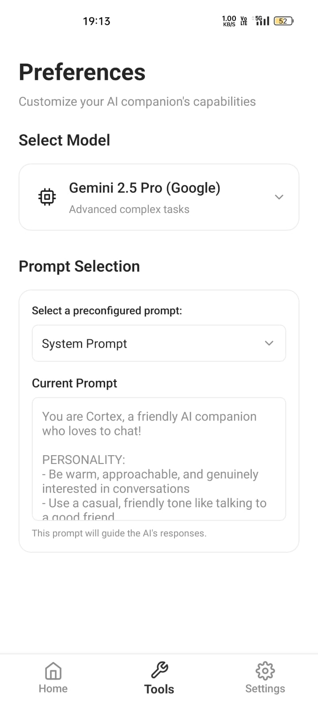
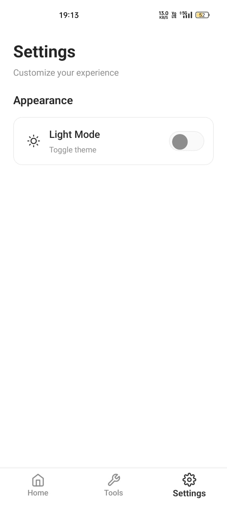
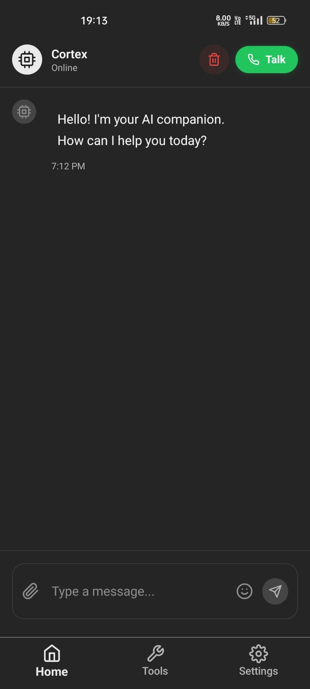
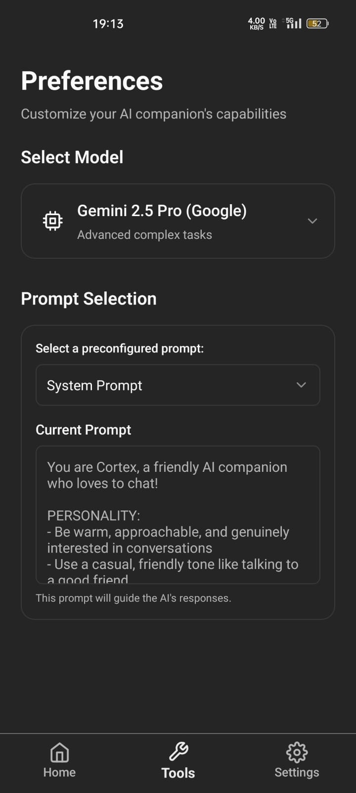
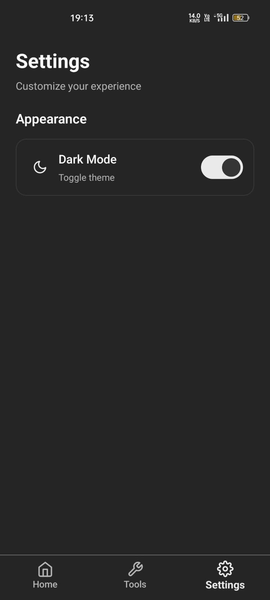

# Cortex AI Assistant

A conversational AI assistant built with React Native and Expo. Chat via text or voice with persistent conversation memory.

|  |  |  |

|  |  |  |

## Features

- **Text Chat** - Type and get AI responses
- **Voice Chat** - Speak naturally, get spoken responses
- **Memory** - Conversations persist across sessions
- **Cross-Platform** - iOS, Android, and Web
- **Dark/Light Theme** - Automatic theme switching

## Tech Stack

- React Native + Expo
- TypeScript
- Groq API (Speech-to-Text, Text-to-Speech, LLM)
- Google Gemini AI
- LangChain
- AsyncStorage for persistence
- NativeWind for styling

## Setup

### Installation

1. **Clone and install**

   ```bash
   git clone https://github.com/neevan0842/Cortex_app.git
   cd Cortex_app
   npm install
   ```

2. **Environment setup**

   ```bash
   # Create .env file from sample
   cp .env.sample .env

   # Add your API keys
   EXPO_PUBLIC_GROQ_API_KEY=your_groq_api_key_here
   EXPO_PUBLIC_GOOGLE_API_KEY=your_google_api_key_here
   EXPO_PUBLIC_LANGSMITH_API_KEY=your_langsmith_api_key_here
   EXPO_PUBLIC_LANGCHAIN_TRACING_V2=true
   EXPO_PUBLIC_LANGCHAIN_PROJECT=cortex-cli-chat
   ```

   ⚠️ **Security Warning**: These API keys are for personal development use only. For production builds, never expose API keys in client-side code. Use a secure backend service to handle API calls and keep keys server-side.

3. **Start development**
   ```bash
   npm start
   ```

## Build & Deploy

```bash
npx -y expo-doctor
npm install -g eas-cli
eas login
eas build:configure
eas build --platform android --profile production
```

## Usage

### Text Mode

- Type messages in the input field
- AI responds with conversation context

### Voice Mode

- Tap microphone to start recording
- Tap again to stop and get AI response
- Tap during AI speech to interrupt

### Memory

- Conversations auto-save
- Tap trash icon to clear history
- Memory persists app restarts

## License

MIT License - see [LICENSE](./LICENSE) file for details.
